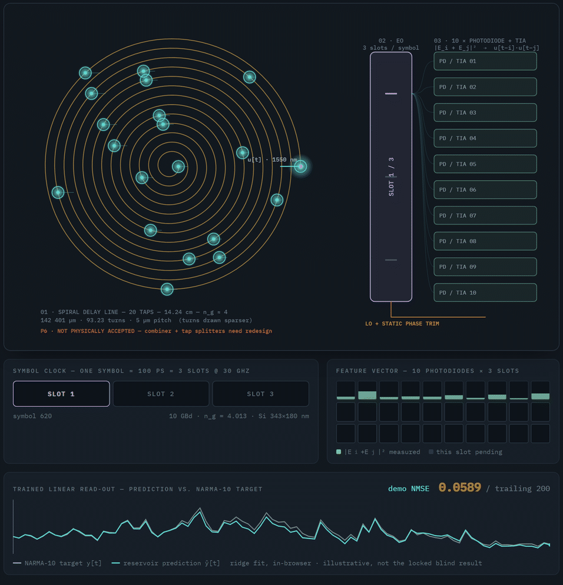
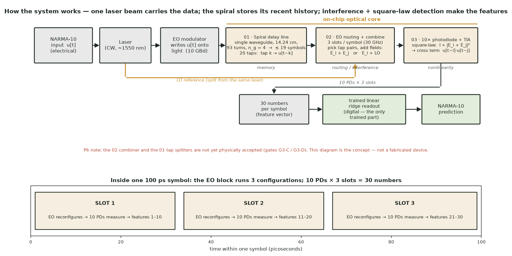
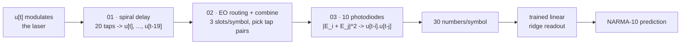
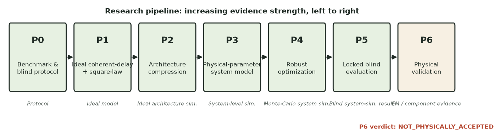
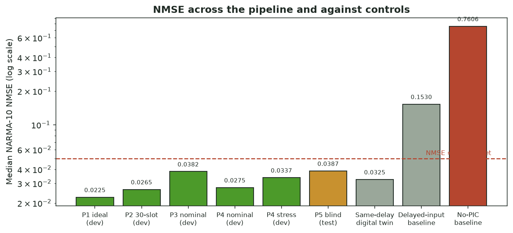
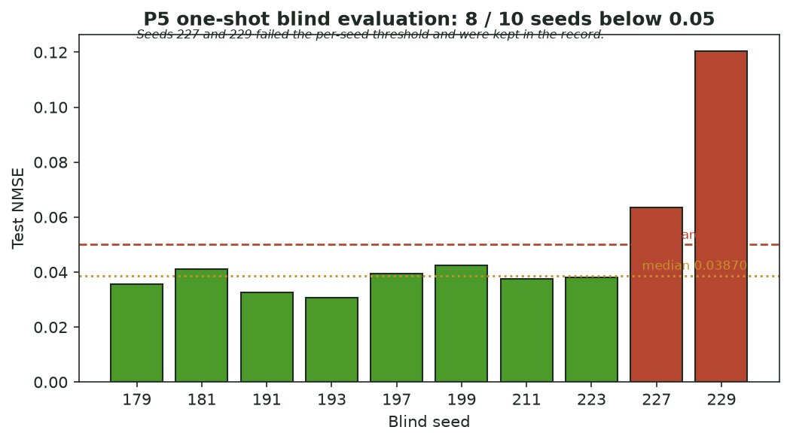
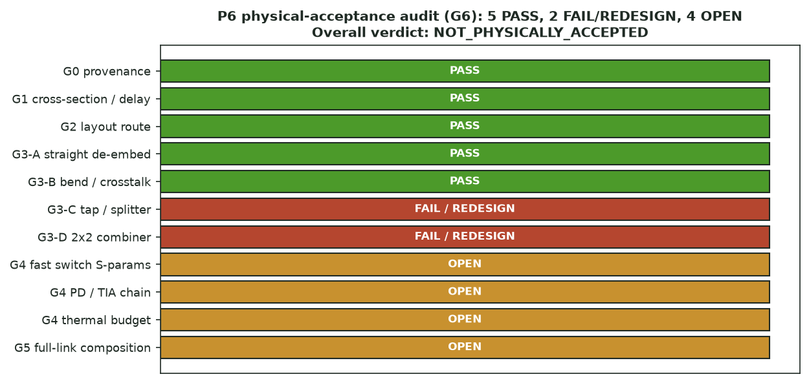

# Photonic Reservoir Computing with a Coherent Optical Delay Line and Square-Law Readout

A staged, blind-tested study of whether a physically motivated integrated-photonic
architecture — coherent optical time delay, optical interference, and square-law
photodetection — can generate the temporal nonlinear features needed for the
NARMA-10 benchmark, together with a component-level physical-validation campaign
for the selected architecture.

> **Evidence boundary (read first).**
> The headline NARMA-10 result is from a **physically parameterized system
> simulation** with a locked, one-shot blind evaluation. It is **not** a
> fabricated photonic integrated circuit (PIC), **not** a foundry-ready layout,
> and **not** an experimental device measurement. The component physical-validation
> phase (P6) currently returns **`NOT_PHYSICALLY_ACCEPTED`**: several gates pass,
> two component families need redesign, and several device inputs are still open.
> This is treated as a result, not something to hide.

---

## 1. One-paragraph summary

Temporal machine-learning tasks such as NARMA-10 require both **memory** (the
output depends on past inputs) and **nonlinearity** (products of past inputs).
This project asks whether those features can be produced *optically* by delaying
an input-modulated optical field by controlled amounts, letting selected delayed
copies interfere, and detecting the result with photodiodes whose square-law
response supplies the nonlinearity — after which only a linear ridge-regression
readout is trained. Starting from an idealized upper-bound model (P1), the work
compresses the feature set to a hardware-plausible measurement budget (P2), adds
realistic loss/noise/bandwidth/phase-error physics (P3), hardens the design across
hardware and data realizations (P4), and then runs a **single locked blind test**
(P5). The blind median test NMSE is **0.0387** (target `< 0.05`), with 8 of 10
blind seeds below threshold; the optical architecture beats a delayed-input linear
baseline by 74.7 % and a memoryless baseline by 94.9 %, while paying a 19.2 %
accuracy penalty relative to a lossless digital twin of the same feature set. The
final phase (P6) tries to substantiate the *physical* implementability of the
selected architecture — waveguide cross-section, 14.24 cm spiral delay route,
bends, crosstalk, splitters/taps, combiner, detectors, and thermal budget — using
mode solving and selected FDTD. That campaign is **not yet complete**: 5 of 11
physical gates pass, the tap/splitter and 2×2 combiner cells need redesign, and
external device/PDK evidence is still required.

## 2. Research question

> Can a physically realizable integrated-photonic architecture use **coherent,
> time-delayed optical fields** and **square-law photodetection** to generate the
> temporal nonlinear features required for NARMA-10, reaching a blind-test median
> NMSE below 0.05 while demonstrably beating same-memory digital and
> photonics-free controls — and can the required optical components be shown to be
> physically plausible?**

The project originates from a broader interest in **recurrent and reservoir
photonic computation**, in particular microring-resonator (MRR) reservoirs. As the
work matured, the *principal* research line moved away from ring resonators toward
an explicit coherent-delay architecture, because the delay + interference +
detection chain is easier to reason about physically and to separate from
digital-equivalent baselines. The earlier three-ring direction is retained as
research history under [`archive/legacy_three_ring/`](archive/legacy_three_ring/).

## 3. Why photonics?

- **Delay-based memory.** A length of waveguide is a near-ideal, low-power,
  broadband delay; tapping it at several points yields a tapped-delay line without
  active recurrence.
- **Coherent interference.** Combining delayed field copies before detection
  produces sums and differences of fields; the photodiode then returns
  `|E_i + E_j|²`, i.e. cross-terms `u[t-i]·u[t-j]` — exactly the quadratic
  temporal features NARMA-10 needs.
- **Photodetection nonlinearity.** Square-law detection is an intrinsic, passive
  nonlinearity that needs no optical nonlinear material.
- **Parallelism.** Multiple taps, local-oscillator branches, and detector slots
  can be read in parallel or time-multiplexed.

Energy-efficiency and speed advantages are **not** claimed here: they were not
quantified against a calibrated electronic baseline. See
[`docs/SCIENTIFIC_BACKGROUND.md`](docs/SCIENTIFIC_BACKGROUND.md).

## 4. From the microring idea to the current architecture

Early literature study (see [`docs/references/literature_review.md`](docs/references/literature_review.md))
covered single-ring intrinsic-memory limits, time-delay ring reservoirs with
feedback, TCMT parameter maps, deep multi-ring reservoirs, and continuous-time
photonic RNNs. Two lessons shaped the current line:

1. **Silicon ring memory does not transfer for free.** Free-carrier and
   thermo-optic memory in silicon rings is platform-specific; a SiN/Kerr or a
   custom process needs its *own* memory mechanism. What *does* transfer is the
   methodology: masked input → virtual nodes, linear-only readout, and rigorous
   controls.
2. **Readout artefacts can masquerade as reservoir memory.** Following
   Bazzanella et al. (2022), the same readout must be applied to the raw input
   and to memory-free controls, or an apparent "reservoir" result can be an
   artefact of the modulator/detector chain.

The current P4/P5 candidate is therefore **not** a nonlinear-MRR reservoir. It is
a tapped coherent-delay front end with square-law detection and a linear readout.
The word "reservoir" is used in the loose sense of *fixed nonlinear temporal
feature map + trained linear readout*; no trained physical recurrent network is
claimed.

## 5. How it works — a plain-language walk-through



*Frame-captured from the interactive page. A light pulse train crawls the
14.24 cm spiral past the 20 taps; the electro-optic block steps through 3 slots
each 100 ps symbol; the feature vector fills 10 values per slot; and a ridge
read-out (fitted in-browser, demo NMSE ≈ 0.03–0.06) tracks the NARMA-10 target.
Concept only — turns drawn sparser than the real 93. The live version with speed
and step controls is [`docs/animation.html`](docs/animation.html).*

The whole machine is one continuous laser beam that carries the data, a long
coiled waveguide that stores the recent past of that data, and a set of detectors
that turn interference between delayed copies into numbers. Only the very last
step — a linear readout — is trained.

The same architecture as a static schematic:



…and as a labelled visual model:


*Left — `01` the single spiral delay line (14.24 cm, 93 turns, 5 µm pitch, Si
343 × 180 nm; cyan dots = the 20 taps). Centre — `02` the fast electro-optic
routing/combine layer (3 slots per symbol). Right — `03` the 10 photodiode + TIA
receiver branches, fed a shared `LO + static phase trim` rail. This is a
**presentation model** captured from the author's live Blender session; its
numbers match the layout records, but the on-disk `mcp.blend` does not contain
this geometry and `P6: NOT PHYSICALLY ACCEPTED` still applies. See
[`artifacts/blender/README.md`](artifacts/blender/README.md).*

### Step by step

1. **Input.** The NARMA-10 sequence `u[t]` is an ordinary electrical signal.
2. **Laser + modulator.** A continuous laser beam is split in two. One copy (the
   *local oscillator*, LO) is kept as a phase reference. The other passes through
   an electro-optic modulator that writes `u[t]` onto the light's amplitude, at
   **10 GBd** — one symbol every **100 picoseconds**.
3. **Spiral delay line (block 01) — the memory.** The modulated light is injected
   into a *single* silicon waveguide coiled into an Archimedean spiral: 14.24 cm
   long, ~93 turns, in about 1 mm². Light travels it in ~1.9 ns, i.e. **19
   symbols**. So at any instant the spiral holds the last 19 symbols of input,
   in flight, like a 19-place queue.
4. **Taps — 20 delayed copies.** At 20 fixed points along the spiral, a small
   passive coupler pulls off a little light and lets the rest continue. The light
   from tap `k` is a copy of `u[t−k]` — it has travelled `k` symbols' worth of
   distance, so it is `k` symbols old. Twenty taps give `u[t]`, `u[t−1]`, …,
   `u[t−19]`. **This is the memory made explicit.**
5. **EO routing + combine (block 02).** A fast electro-optic layer selects which
   pairs of tap outputs to add together (and where to send the LO). Adding two
   optical *fields* — `E_i + E_j` — makes them interfere.
6. **Photodiodes (block 03) — the nonlinearity.** Each detector measures optical
   *power*, i.e. `|E_i + E_j|²`. Expanding that square produces the cross term
   `u[t−i]·u[t−j]` — exactly the product-of-past-inputs that NARMA-10 needs. No
   nonlinear optical material is required; the photodiode's squaring *is* the
   nonlinearity. A trans-impedance amplifier (TIA) turns each tiny photocurrent
   into a number.
7. **Readout.** Ten detectors, read three times per symbol (see below), give
   **30 numbers per symbol**. Those 30 numbers feed a trained linear
   ridge-regression readout that outputs the NARMA-10 prediction. The readout is
   the *only* trained part; everything before it is fixed.

### Inside one 100 ps symbol

Within each symbol period the EO layer runs through **3 configurations** ("slots"):

| Slot (≈33 ps each) | What happens | Produces |
|---|---|---|
| 1 | EO wires one fixed set of tap pairs to the 10 detectors; they measure | features 1–10 |
| 2 | EO reconfigures to a different fixed set; 10 detectors measure again | features 11–20 |
| 3 | EO reconfigures once more; 10 detectors measure | features 21–30 |

Then the next symbol enters, all the light in the spiral shifts forward by one tap
position, and the same 3-slot pattern repeats. The wiring pattern is **fixed**
(chosen once, on training data, in phases P2/P4); only the input marching through
it changes.

### Why a single spiral

Twenty *independent* delay lines would need ~1.4 m of waveguide and a large
chip. One continuous spiral with 20 taps along it needs only **14.24 cm** and
fits in ~1 mm². (An early "double spiral" idea was rejected in P6 gate G2 because
its centre U-turn fell below the minimum bend radius.)

### Selected configuration (P4/P5)

Values from the committed result records:

| Quantity | Value | Source |
|---|---|---|
| Coherent intensity features (sparse, task-selected) | 30 | [`p4-optimization/RESULTS.md`](p4-optimization/RESULTS.md) |
| Photodiodes | 10 | " |
| Time-multiplexed slots per symbol | 3 | " |
| Symbol rate | 10 GBd | [`p3-realistic/RESULTS.md`](p3-realistic/RESULTS.md) |
| Slot rate | 30 GHz | " |
| Required receiver bandwidth | ≈ 15 GHz (modeled at 50 GHz) | " |
| Maximum optical delay | 19 symbols | [`p6-physical-validation/P6-PROTOCOL.md`](p6-physical-validation/P6-PROTOCOL.md) |
| Longest delay route | ≈ 14.24 cm (142 400.6 µm) at `n_g ≈ 4` | [`p6-physical-validation/G2-LAYOUT-ACCEPTANCE.md`](p6-physical-validation/G2-LAYOUT-ACCEPTANCE.md) |
| Per-branch scale | 5 mW signal + 5 mW LO (normalized to `u = 1`) | [`p4-optimization/RESULTS.md`](p4-optimization/RESULTS.md) |

Compact signal path:



Component-by-component rationale and evidence level:
[`docs/DESIGN_RATIONALE.md`](docs/DESIGN_RATIONALE.md). The two optical elements
that do the combining — the block 02 combiner and the block 01 tap splitters —
are **not yet physically accepted** (P6 gates G3-C / G3-D); the figure above is
the concept, not a fabricated device.

## 6. Research pipeline



| Phase | Question | Main outcome | Evidence level |
|---|---|---|---|
| **P0** | What is the exact benchmark, split, target, and blind protocol? | 20 dataset commitments hash-locked; development/blind seeds separated; blind test disabled until candidate + source are locked | Protocol / integrity |
| **P1** | Can *ideal* coherent delayed-field + square-law features solve NARMA-10? | Ideal 230-channel basis: median validation NMSE **0.022534**; linear 20-lag control 0.154694 | Idealized mathematical model (upper bound) |
| **P2** | How few physical measurements still pass? | 230 ideal channels → 30 task-selected channels on 10-PD/3-slot budget; 30-slot median **0.026459** (9/10 seeds) | Ideal, lossless architecture simulation |
| **P3** | Does it survive realistic loss, noise, phase error, bandwidth? | Nominal profile passes: median **0.038246** (9/10); single-PD 30-slot rejected on real-time bandwidth; stress profile fails | Physical-parameter system simulation |
| **P4** | Is it robust across hardware and data realizations? | 5 hardware × 10 data seeds: nominal median **0.027499**, stress median **0.033723**, 45/50 runs `≤ 0.05` each | Monte-Carlo system simulation |
| **P5** | Blind test. | One locked run: blind median test NMSE **0.038705**, 8/10 seeds `< 0.05`; beats delayed-input by 74.7 %, no-PIC by 94.9 % | **Locked blind system-simulation result** |
| **P6** | Are the required optical components physically plausible? | 5/11 gates PASS; tap/splitter and 2×2 combiner **FAIL/REDESIGN**; switch, PD/TIA, thermal, composition **OPEN** → **`NOT_PHYSICALLY_ACCEPTED`** | EM / component-level validation (incomplete) |

## 7. Key results



From the canonical records ([`docs/RESULTS_SUMMARY.md`](docs/RESULTS_SUMMARY.md)
has the full table with SHA-256 provenance):

- **P1 ideal upper bound:** median validation NMSE **0.022534** (coherent field-`u`
  + square-law, 230 channels). Not a PIC result.
- **P2 selected architecture:** 30 time-multiplex slots, median **0.026459**,
  9/10 development seeds `≤ 0.05`.
- **P3 nominal realistic model:** 30 features, 10 PD × 3 slots, median **0.038246**,
  9/10 seeds. The stress profile did **not** pass.
- **P4 robustness:** nominal median **0.027499** (P90 0.044108); stress median
  **0.033723** (P90 0.051650); 45/50 runs pass in each profile.
- **P5 blind test (headline):**

  | Metric | Value |
  |---|---|
  | Blind median test NMSE | **0.0387049671** |
  | Blind seeds with NMSE `< 0.05` | **8 / 10** |
  | Delayed-input baseline median | 0.1530487464 (candidate is 74.71 % better) |
  | No-photonic-core baseline median | 0.7606056879 (candidate is 94.91 % better) |
  | Lossless same-delay digital twin | 0.0324712617 (candidate pays a 19.20 % penalty) |
  | Paired 95 % bootstrap CI upper bound vs. both controls | `< 0` |

  

  P5 is the **strongest computational result**. It is a system-simulation result,
  **not** experimental hardware performance. The optical architecture is *not more
  accurate* than its digital twin; its interest is that it produces the quadratic
  temporal features **physically**, through coherent interference and
  photodetection, and still clears the blind NARMA-10 target while beating
  same-memory and memory-free controls.

## 8. P5 blind-test integrity

- The blind seeds (179–229) and their exact NARMA-10 datasets were hash-committed
  in P0 **before** any model was chosen.
- A candidate configuration and its source code were frozen (`candidate-lock-v2`,
  SHA-256 `664904b3…`); the blind evaluator refuses to run without a matching lock.
- Protocol v1 was **retired unused** (0 blind evaluations) when a development
  preflight showed its "beat your own lossless digital twin by 10 %" gate was
  logically impossible; v2 uses the digital twin as a reported upper bound instead.
- Blind seeds 227 (0.0636) and 229 (0.1203) failed the per-seed threshold and
  were **kept** in the record.
- The blind run produced an authorized output file and, by protocol, **cannot be
  re-run**. It is not tuned from and is frozen publication evidence.

Full hash list: [`docs/RESULTS_SUMMARY.md`](docs/RESULTS_SUMMARY.md) and
[`p5-publication/RESULTS.md`](p5-publication/RESULTS.md).

## 9. Physical-validation status (P6)



**Current verdict: `NOT_PHYSICALLY_ACCEPTED`.** This is *not* a rejection of the
P5 computational result — it means the component-level physical evidence chain is
incomplete. Details: [`docs/PHYSICAL_VALIDATION.md`](docs/PHYSICAL_VALIDATION.md)
and [`p6-physical-validation/G6-PHYSICAL-ACCEPTANCE.md`](p6-physical-validation/G6-PHYSICAL-ACCEPTANCE.md).

| Physical gate | Status | Note |
|---|---|---|
| G0 provenance (P5 hash lock) | **PASS** | Blind/candidate hashes match |
| G1 waveguide cross-section & delay | **PASS** | 343 × 180 nm Si strip, `n_g = 4.01297`, process window ± spec |
| G2 spiral delay route | **PASS** | Single-series Archimedean spiral, GDS length 142 400.6 µm (0.0006 % error), pitch 5 µm, min radius 10 µm |
| G3-A straight de-embedding | **PASS** | Mesh-converged lossless reference |
| G3-B bend & adjacent-turn crosstalk | **PASS** | R = 10 µm bend, `−0.0037 dB/90°`; 5 µm pitch crosstalk `< −124 dB` |
| G3-C progressive tap / LO splitter | **FAIL / REDESIGN** | Directional coupler, Y-splitter, MMI series, slot-Y and union-Y all missed imbalance/reflection/energy gates |
| G3-D 2×2 coherent combiner | **FAIL / REDESIGN** | Two-source FDTD and EME length screens failed imbalance/excess/reflection/quadrature |
| G4 fast (30 GHz) selector S-parameters | **OPEN** | No device S-parameters yet |
| G4 50 GHz PD/TIA chain | **OPEN** | No measured responsivity/noise/saturation/linearity |
| G4 thermal budget | **OPEN** | No `PπL`, time-constant, or crosstalk solve |
| G5 full-link composition | **OPEN** | Cannot compose while device losses are missing |

**What still stands physically:** the delay cross-section, the exact spiral route,
the R = 10 µm bend, and adjacent-turn crosstalk. Assumption-only propagation
(`0.8 dB/cm`) plus bends gives `0.8974 dB/cm`, inside the P5 stress envelope but
**not** a physical loss acceptance without foundry/cutback data.

The chosen path forward is a **custom 343 × 180 nm process**, not migration to a
ready 220 nm PDK; the frozen validation contract is in
[`p6-physical-validation/CUSTOM-PROCESS-VALIDATION.md`](p6-physical-validation/CUSTOM-PROCESS-VALIDATION.md).

## 10. What has been demonstrated / what has not

**Demonstrated (within the stated evidence levels):**

- An idealized coherent-delay + square-law feature basis spans the linear and
  quadratic temporal terms NARMA-10 needs (P1).
- A compressed 30-feature / 10-PD / 3-slot architecture keeps development accuracy
  under realistic nominal loss, noise, phase-error and bandwidth (P3).
- The design is robust across 5 hardware × 10 data realizations (P4).
- A **single locked blind test** clears median NMSE `< 0.05` (8/10 seeds) and
  beats same-memory-linear and memory-free controls with bootstrap CIs excluding
  zero (P5).
- Cross-section, delay route, bend, and adjacent-turn crosstalk are EM-supported
  (P6 G1, G2, G3-A, G3-B).

**Not demonstrated:**

- Any fabricated PIC or measured end-to-end hardware result.
- Foundry-qualified or redesigned splitter/tap and 2×2 combiner components
  (G3-C, G3-D currently FAIL/REDESIGN).
- Measured propagation loss (needs cutback/PDK), 30 GHz switching, a measured
  50 GHz PD/TIA chain, and a full thermal matrix (G4 OPEN).
- A composed full-link physical budget (G5 OPEN) and overall physical acceptance
  (G6 = `NOT_PHYSICALLY_ACCEPTED`).
- Any energy or speed advantage over an electronic baseline.
- A trained physical recurrent neural network.

## 11. Repository map

Read the science first (Section 12), then use this map.

```
README.md                     This document
docs/
  PROJECT_OVERVIEW.md          Short project description
  SCIENTIFIC_BACKGROUND.md     Reservoir computing, photonic memory, why this design
  METHODOLOGY.md               What each phase did and why; code entry points
  RESULTS_SUMMARY.md           Full P1–P6 result + SHA-256 provenance table
  PHYSICAL_VALIDATION.md       Honest P6 / G6 gate-by-gate account
  DEVELOPMENT_HISTORY.md       Three-ring origin -> coherent-delay line -> P6
  LIMITATIONS.md               Computational / system / component / experimental
  REPRODUCIBILITY.md           Safe commands; what must never be re-run
  DESIGN_RATIONALE.md          Component-by-component rationale table
  figures/                     Generated figures (scripts/make_figures.py) + Blender renders
  references/                  Bibliography, source->design map, glossary, literature review
  index.html                  Static navigation page
  _source_records/             Original Turkish project notes, kept verbatim for provenance
P0-BENCHMARK-AND-BLIND-PROTOCOL.md, MODEL-AND-ACCEPTANCE.md   Frozen protocol
src/photonic_reservoir/        Python package (benchmark, phases, protocol guard)
scripts/                       P0 verifier + P1–P5 workflows + make_figures.py
tests/                         unittest suite for the package (50 tests)
configs/                       P0 protocol JSON (v1 retired, v2 canonical)
p1-coherent-delay/ … p5-publication/   Per-phase README, RESULTS, configs/, runs/
p6-physical-validation/        Component/EM campaign: gate docs, code, configs, layout/, runs/
  README.md                    Verdict-first landing page
  SCRIPT_INDEX.md              What each g*.py / inverse_design_*.py script does
  layout/                      spiral-centerline-v1.{gds,csv,svg}  (Git LFS)
  runs/                        JSON summaries + 59 HDF5 solver outputs (Git LFS)
  _unclassified_solver_scratch/  8 unlabeled solver downloads, provenance unclear (Git LFS)
artifacts/
  blender/                     mcp.blend (author scene), build_spiral_reference.py, renders
  figures/                     Mirror of docs/figures
archive/
  legacy_three_ring/           Earlier SiN three-ring reservoir work (research history)
provenance/                    Manifest, environment, decision log, research log
CITATION.cff                   Citation metadata (license still to be chosen)
```

Where to go for a specific thing:

| You want… | Go to |
|---|---|
| The blind result and its hashes | [`p5-publication/RESULTS.md`](p5-publication/RESULTS.md) |
| The full results table | [`docs/RESULTS_SUMMARY.md`](docs/RESULTS_SUMMARY.md) |
| The honest physical status | [`docs/PHYSICAL_VALIDATION.md`](docs/PHYSICAL_VALIDATION.md) |
| Raw FDTD / mode-solve outputs | `p6-physical-validation/runs/*.hdf5` (Git LFS) |
| The layout | `p6-physical-validation/layout/` (Git LFS) |
| The archived three-ring experiments | [`archive/legacy_three_ring/`](archive/legacy_three_ring/) |

## 12. Reading order

1. [`docs/PROJECT_OVERVIEW.md`](docs/PROJECT_OVERVIEW.md) — 2 minutes.
2. [`P0-BENCHMARK-AND-BLIND-PROTOCOL.md`](P0-BENCHMARK-AND-BLIND-PROTOCOL.md) and
   [`MODEL-AND-ACCEPTANCE.md`](MODEL-AND-ACCEPTANCE.md) — the rules of the game.
3. `p1-coherent-delay/` → `p5-publication/` — one `RESULTS.md` each, in order.
4. [`docs/RESULTS_SUMMARY.md`](docs/RESULTS_SUMMARY.md) — consolidated numbers.
5. [`p6-physical-validation/README.md`](p6-physical-validation/README.md) →
   [`docs/PHYSICAL_VALIDATION.md`](docs/PHYSICAL_VALIDATION.md).
6. [`docs/LIMITATIONS.md`](docs/LIMITATIONS.md) and
   [`docs/DEVELOPMENT_HISTORY.md`](docs/DEVELOPMENT_HISTORY.md).

For a plain-language walkthrough of every phase (in Turkish, written for a reader
new to the topic): [`docs/SUREC-ACIKLAMASI-TR.md`](docs/SUREC-ACIKLAMASI-TR.md).

**Interactive:** [`docs/animation.html`](docs/animation.html) — a self-contained
animation of the running system (light crossing the spiral, the 3-slot electro-optic
cycle, 10 photodiodes, and a live in-browser ridge read-out predicting NARMA-10).
Open it in a browser.

## 13. Reproducibility

Python ≥ 3.11 (developed on 3.14). Dependencies are pinned in
[`requirements-lock.txt`](requirements-lock.txt); the package needs only NumPy and
Matplotlib.

```bash
python -m venv .venv && source .venv/bin/activate      # Windows: .venv\Scripts\activate
pip install -r requirements-lock.txt
pip install -e . --no-deps

export PYTHONPATH="$PWD/src"                            # Windows: $env:PYTHONPATH="$PWD\src"
python scripts/verify_p0_protocol.py                    # expect blind_test_authorized: false
python -m unittest discover -s tests -v                 # 50 tests

python scripts/make_figures.py                          # regenerate docs/figures/fig*.png
```

P6 mode-solver / FDTD scripts additionally need the Tidy3D SDK and, for cloud
runs, credentials and explicit cost approval — see
[`p6-physical-validation/README.md`](p6-physical-validation/README.md).

> **Do not run `scripts/run_p5_blind.py`.** The blind evaluation is a locked,
> one-shot result; the protocol and this repository intentionally prevent a
> second blind evaluation. Safe reproduction paths (development preflights,
> protocol checks) are documented separately in
> [`docs/REPRODUCIBILITY.md`](docs/REPRODUCIBILITY.md).

## 14. Limitations

Summarized in [`docs/LIMITATIONS.md`](docs/LIMITATIONS.md), separated into
computational, system-model, component-model, and fabrication/experimental
limitations. The failed P6 gates are listed there explicitly.

## 15. Selected references

Full bibliography with per-entry "used in this project for…" notes:
[`docs/references/references.md`](docs/references/references.md) ·
[`docs/references/references.bib`](docs/references/references.bib) ·
design-decision mapping: [`docs/references/source_to_design_map.md`](docs/references/source_to_design_map.md).

- Donati et al. (2024), *Opt. Express* — [10.1364/OE.514617](https://doi.org/10.1364/OE.514617) — time-delay ring reservoir with fiber feedback; delay-loop + readout methodology.
- Bazzanella et al. (2022), *J. Lightwave Technol.* — [10.1109/JLT.2022.3183694](https://doi.org/10.1109/JLT.2022.3183694) — single-ring intrinsic-memory limit; the "apply the readout to the input too" control.
- Giron Castro et al. (2024), *Opt. Express* — [10.1364/OE.509437](https://doi.org/10.1364/OE.509437) — TCMT + RK4 parameter map, power–detuning operating regimes.
- Tait et al. (2017), *Sci. Rep.* — [10.1038/s41598-017-07754-z](https://doi.org/10.1038/s41598-017-07754-z) — broadcast-and-weight continuous-time photonic RNN (a *distinct* architecture).
- Dong et al. (2026), *Opt. Laser Technol.* — [10.1016/j.optlastec.2025.114614](https://doi.org/10.1016/j.optlastec.2025.114614) — deep three-ring reservoir; NARMA-10 depth scaling.
- Ren et al. (2024), *Opt. Express* — [10.1364/OE.518063](https://doi.org/10.1364/OE.518063) — nonlinear ring + linear high-Q ring array for compact memory.

## 16. License and citation

**No license has been chosen yet.** Until a `LICENSE` file is added, default
copyright applies and reuse terms are undefined — please contact the author before
redistributing. See [`CITATION.cff`](CITATION.cff) for citation metadata and
[`docs/_source_records/`](docs/_source_records/) for the original project notes.

---

*This repository was reorganized and documented for academic review. No numerical
result, benchmark definition, seed list, candidate lock, or protocol hash was
modified in that process, and the P5 blind evaluation was not re-run. See
[`REORGANIZATION_REPORT.md`](REORGANIZATION_REPORT.md).*
