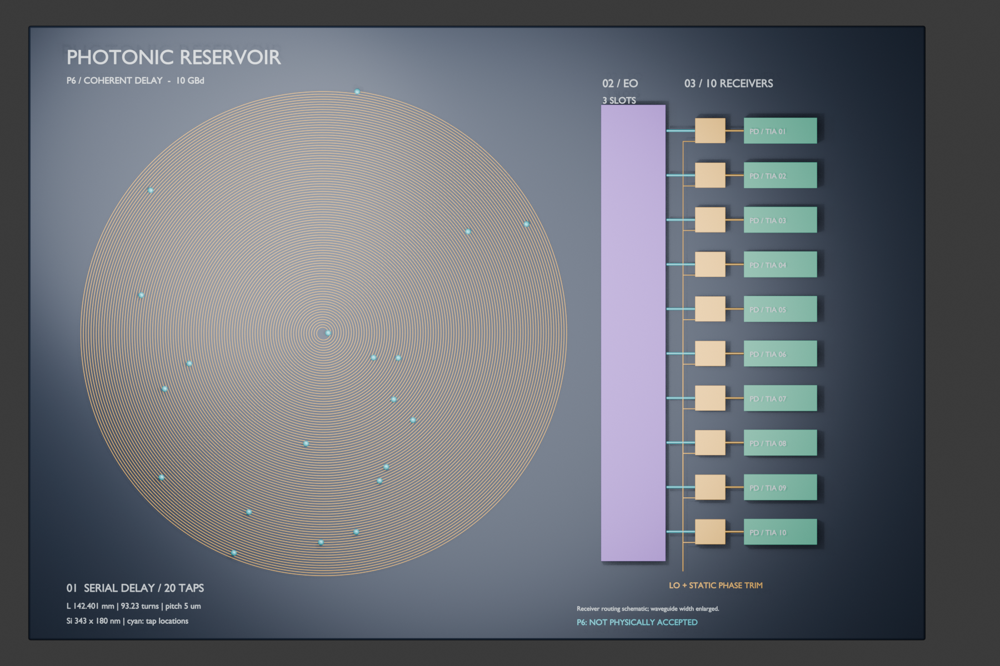

# Project overview

This archive preserves a staged snapshot of the Photonic Reservoir research line and a copied Blender presentation scene. It was created without modifying the source project or the canonical on-disk Blender file.

The represented P6 design contains a 20-tap delay route and a 10-photodiode-by-3-slot receiver concept. It is an architectural visualization and evidence-navigation artifact, not a mask layout.

The render is a connected-Blender-session output whose association with `blender/scenes/mcp.blend` is unverified. It is included for documentation, not as a measured device image.
